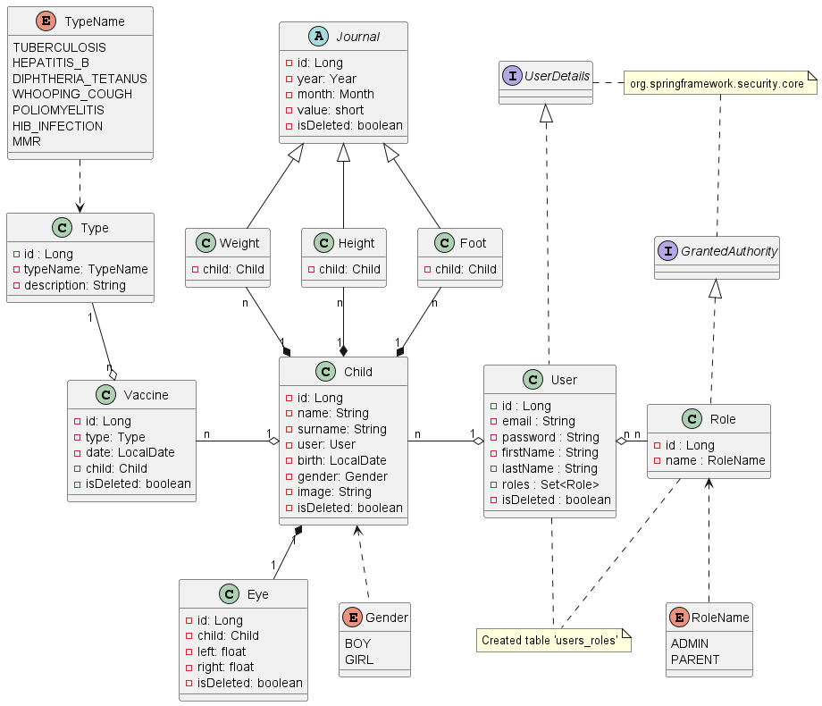

# Child Vaccination Diary


## Description
**Child Vaccination Diary** is an application designed for parents to conveniently track their children's vaccinations and store information about their height, weight, eye health, and other important health metrics.

---
## Technologies
- **Java 17**: The main programming language.
- **Spring Boot 3.2.10**: Used to create REST APIs.
- **PostgreSQL 42.6.2**: Database.
- **Liquibase 4.24.0**: Database schema management.
- **MapStruct 1.6.2**: For mapping DTOs to entities.
- **JWT (JSON Web Tokens) 0.12.6**: For authentication.
- **Swagger (Springdoc OpenAPI) 2.6.0**: API documentation.
- **Docker Compose 3.2.10**: Simplifies container orchestration for the application.
---

## Requirements
- **Java 17** or higher.
- **Maven 3.8+**.
- **PostgreSQL 14+**.
- **Docker & Docker Compose** (optional but recommended).

---

## Setup
### 1. Clone the Repository
```bash
git clone https://github.com/fe-july-91/ChildVaccinationDiary.git
cd ChildVaccinationDiary
```
### 2. Configure the Database
   - If running locally, create a PostgreSQL database and update the application.properties file:
```
   spring.datasource.url=jdbc:postgresql://localhost:5432/child_vaccination_db
   spring.datasource.username=your_username
   spring.datasource.password=your_password
```
   - If using Docker Compose, no manual setup is needed for the database, as it will be handled by Docker.
### 3. Run with Docker Compose
The project supports Docker Compose for running the application and the database in containers.

Steps:
 1. Ensure Docker and Docker Compose are installed.
 2. Build and run the following command to start the services:
```
docker-compose up --build -d 
```
 3. Access the application at http://localhost:8088/api/swagger-ui/index.html
---

### API Documentation
The API documentation is available at: http://localhost:8080/api/swagger-ui/index.html

---

### Development
Key controller classes:
#### 1.AuthenticationController:
- User registration, login, and password recovery.
#### 2. ChildController:
- CRUD operations for child profiles.
- Managing information about height, weight, eye health, and vaccinations.
#### 3. UserController:
- Manages operations related to user profile management, allowing users to reset their password and update their personal data (name and email).

---

### UML Diagram
Below is the UML class diagram for the project's structure


